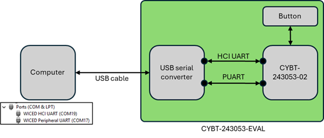
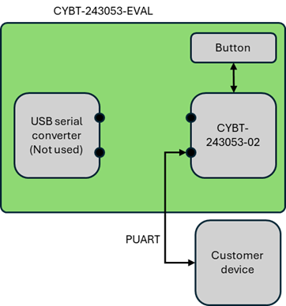

# BLE HID / BT SPP demonstrator

## Overview

This demonstrator illustrates how to use the CYBT-243053-EVAL kit as a BLE HID (keyboard) device and as a BT SPP device.

It can be used to change an "old" wired COM port communication, into a Wireless one.

## Introduction

When you connect the CYBT-243053-EVAL kit to your computer over USB, you will see 2 COM ports: HCI UART and Peripheral UART.

HCI UART can be used to program a new firmware or to control the module over HCI.

Peripheral UART can be used for multiple purpose in application mode (show debug logs, UART communication with host micro-controller - see the diagram below).

## Program the CYBT-243053-EVAL

Connect the kit to your computer over USB and make sure that no program is using the HCI UART COM port.

Inside Eclipse for ModusToolbox, click on program. The tool will use the HCI UART COM port to program the firmware on the CYBT-243053-02 chip.

## Documentation

Documentation about the demonstrator can be find in the doc/ directory as PDF.

BTSDK API documentation is available [online](https://infineon.github.io/btsdk-docs/BT-SDK/index.html)

Note: For offline viewing, git clone the [documentation repo](https://github.com/Infineon/btsdk-docs)

BTSDK Technical Brief and Release Notes are available [online](https://community.infineon.com/t5/Bluetooth-SDK/bd-p/ModusToolboxBluetoothSDK)

 
The Bluetooth&#174; word mark and logos are registered trademarks owned by Bluetooth SIG, Inc., and any use of such marks by Infineon is under license.

## Legal Disclaimer

The evaluation board including the software is for testing purposes only and, because it has limited functions and limited resilience, is not suitable for permanent use under real conditions. If the evaluation board is nevertheless used under real conditions, this is done at one’s responsibility; any liability of Rutronik is insofar excluded. 

